# infinity months of code
# Нету цели в днях - есть цель не оставаться на месте

В данный момент я учусь программированию каждый день в течение 6 месяцев.  
Это мое публичное обязательство.
Я не планирую сам писать код но выучить то что не знает ИИ и то он не автоматизирует.

## 🎯 Моя цель

Уметь решать проблемы бизнесов и свои посредством вайбкодинга.

## 📊 Прогресс

## 📁 Что здесь

- Каждый день — новый коммит
- Вся активность видна на графике выше
- Файлы с кодом — в папках по дням/темам

## ✅ Правила

1. Коммит каждый день (даже если 1 строчка)
2. Код должен запускаться
3. Если застрял — 30 минут, потом смотрю решение и конспектирую

*Дни считаются автоматически по коммитам*
